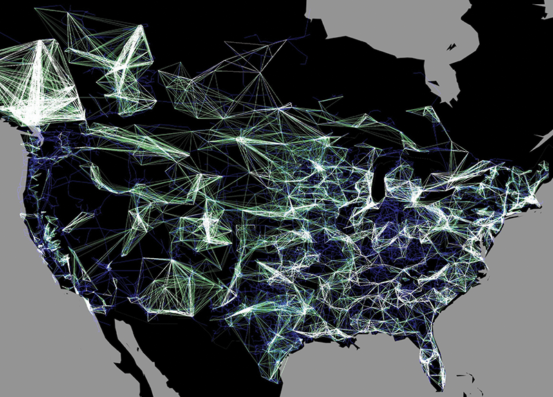

# Network visualization map of the US electric grid

Visualization of the network of interactions between generators in power plants across the United States. A line is drawn between the locations of two generators that mutually influence their frequencies. The blue network in the background shows the connections between generators through transmission lines and substations. Each line is color-coded by how strong the influence is, from dark green (weakest) to white (strongest). A cluster of white links represents a group of generators that are strongly coupled; in such a group, frequency disturbances in one are very likely to disturb others.
