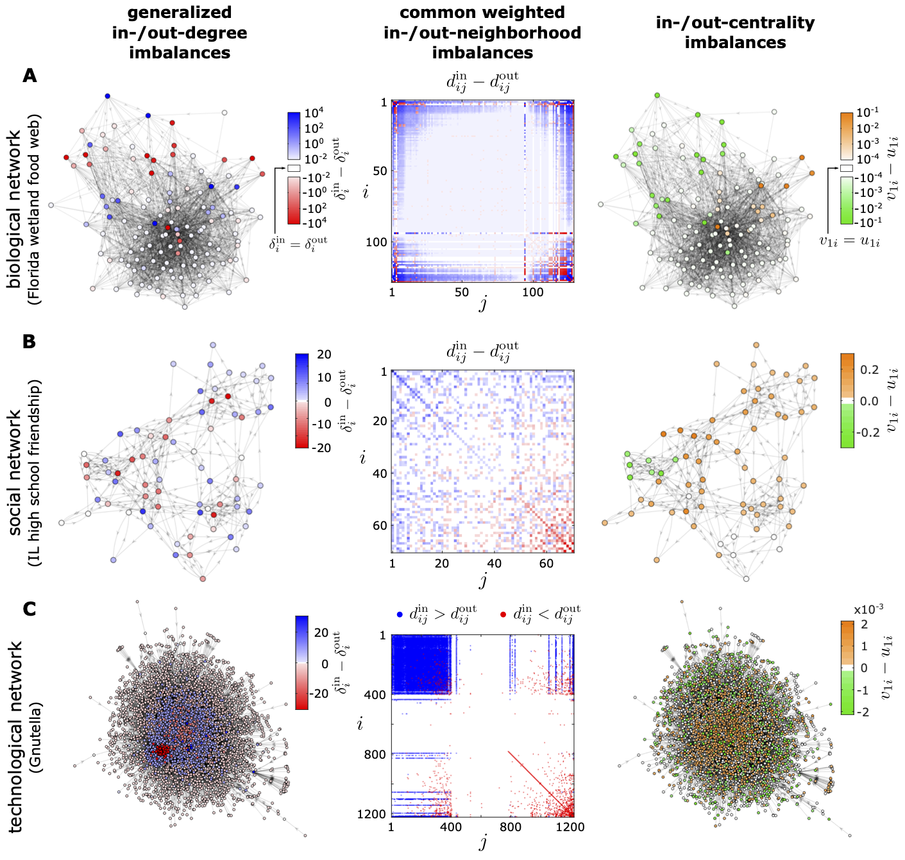

# Visualizations of node connectivity imbalances in real-world networks

Topological and spectral imbalances in 3 sample real-world networks. **A.** Network of feeding relations between species or groups of species in the cypress wetlands of South Florida during the dry season. **B.** Network of friendship relations between boys in an Illinois high school in 1957–1958. **C.** Network of connections between Gnutella host computers in 2002. For a full description, see Figure S2 in our journal publication:

[Network structural origin of instabilities in large complex systems](https://doi.org/10.1126/sciadv.abm8310) 
C. Duan, T. Nishikawa, D. Eroglu, A. E. Motter 
_Science Advances_ **8**, eabm8310 (2022)
